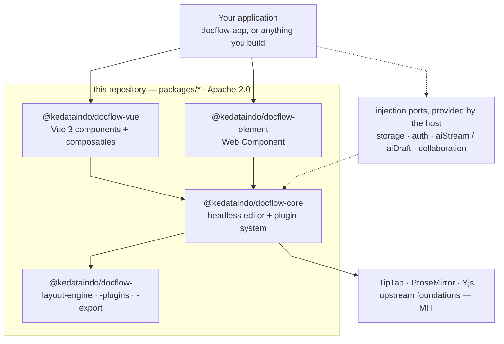
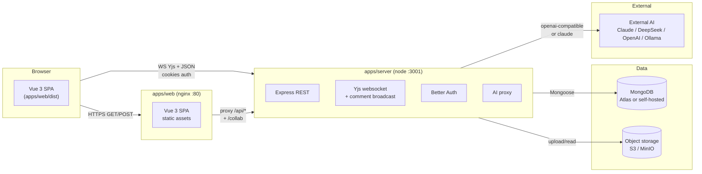
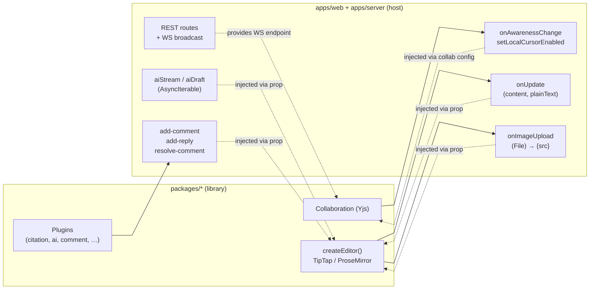
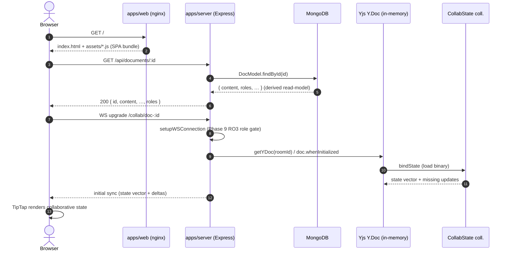
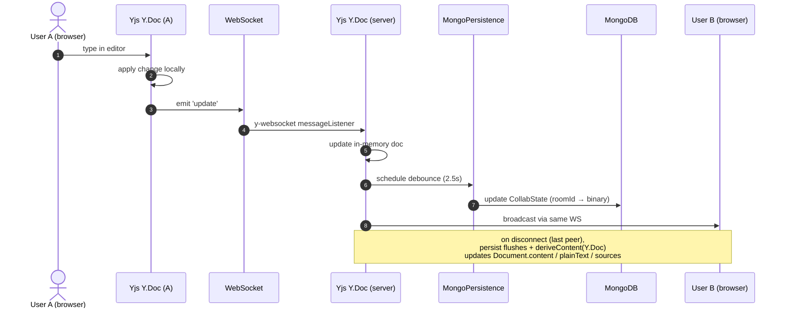
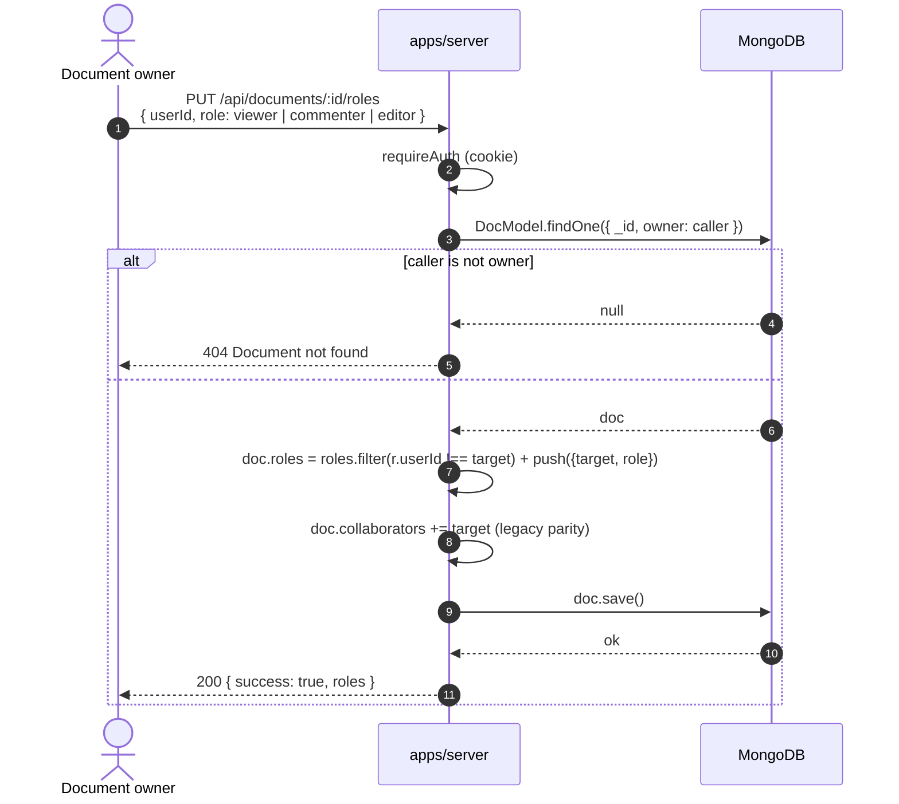
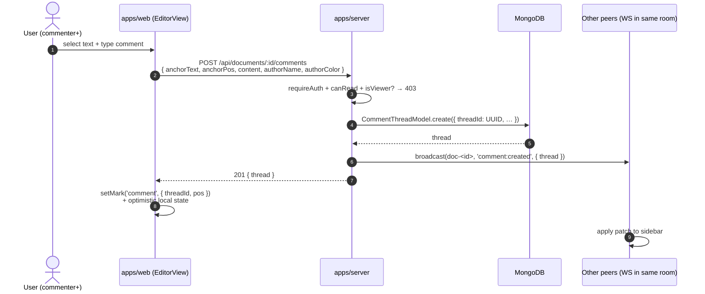

# DocFlow — System Architecture

> **Audience:** AI agents and engineers integrating with, operating, or extending DocFlow.
> **Status:** historical / cross-repo. Documents the **full DocFlow product** (library `packages/*` **plus** the deployable app).
> **Scope:** a complete map of how data flows between the browser, the apps, the server, and the data stores — enough that an agentic AI can write to or serve data on any layer without breaking the others.
>
> ⚠️ **Repository scope note (2026-10):** this repository is **library-only**. The
> deployable application — `apps/web`, `apps/server`, `apps/demo`, `docker/`, `e2e/`
> — was split into `Kedata-Indonesia/docflow-app`.
> Every `apps/*`, `docker/*`, and `e2e/*` path referenced below therefore lives in that
> sibling repo, **not** here. For the library boundary itself, prefer
> [`LIBRARY_CONTRACT.md`](LIBRARY_CONTRACT.md) and the root `README.md`.
>
> This repo ships one runnable app for local UI review: `examples/playground` — a
> backend-free Vite app that mounts `<DocsEditor>` through the public API. It is
> **local-only and untracked** (`.gitignore`, PR #62): restore it with
> `pnpm playground:restore`. It is **not published** and never
> imports a backend package.

The library in one picture — everything in the `LIB` box is published from this repository:



The library never imports a backend: persistence, auth, collaboration and AI all arrive through
the injection ports, which is what keeps `packages/*` free of backend dependencies.

---

## 0. TL;DR

DocFlow is a self-hostable Google-Docs-style editor shipped as three artifacts:

- **`packages/*`** — headless + Vue editor library (TipTap/ProseMirror core, plugins, layout, Vue UI, citations, AI).
- **`apps/web`** — the host product app (Vue 3 SPA, routes dashboard / document / settings). Browser-side.
- **`apps/server`** — Express + MongoDB + Better Auth + Yjs websocket + AI proxy. The only stateful process.

At runtime the system runs **two processes** (browser talks to both):

1. **`apps/web` static SPA** at `https://dev-docflow.kedata.cloud` (same-domain nginx → serves SPA assets).
2. **`apps/server` API** at `https://dev-docflow-server.kedata.cloud:3001` (Express + WS endpoint).

**Yjs CRDT** is the authoritative model for collaborative documents. `Document.content` (ProseMirror JSON) and `plainText` are server-written *derived read-models* for offline/fallback. They are regenerated from the live Yjs state when needed.

**Auth:** Better Auth (session cookie `better-auth.session_token`). MongoDB stores `user`, `session`, plus all app collections. Roles are per-document: `viewer` / `commenter` / `editor` / `owner` (Phase 9 RO1+RO2+RO3, PR #96).

---

## 1. Process model



Three deployable units in production:

| Unit | Source | Build | Image | Runtime |
|------|--------|-------|-------|---------|
| **`web`** (SPA + nginx) | `apps/web` | `Dockerfile.web` | static assets + nginx | nginx serves `dist/` |
| **`server`** (API + WS) | `apps/server` | `Dockerfile.server` | node:22-alpine + tsup-bundled dist | `node dist/index.js` |
| **`demo`** (library showcase) | `apps/demo` | `Dockerfile.demo` | static + nginx | nginx serves `dist/` |

For local dev: `pnpm dev:server` (tsx watch) + `pnpm dev:web` (Vite, proxies `/api/*` and `/collab` to `:3001`).

> **Deploy trap (2026-07-27 incident):** Dokploy's web-on-push does **not** auto-rebuild the server container. After any `apps/server/**` change you must manually redeploy + restart the server service on Dokploy, otherwise the SPA bundle references routes that don't exist on the running server. See `docs/DEPLOYMENT.md` §11.

Three deployable units in production:

| Unit | Source | Build | Image | Runtime |
|------|--------|-------|-------|---------|
| **`web`** (SPA + nginx) | `apps/web` | `Dockerfile.web` | static assets + nginx | nginx serves `dist/` |
| **`server`** (API + WS) | `apps/server` | `Dockerfile.server` | node:22-alpine + tsup-bundled dist | `node dist/index.js` |
| **`demo`** (library showcase) | `apps/demo` | `Dockerfile.demo` | static + nginx | nginx serves `dist/` |

For local dev: `pnpm dev:server` (tsx watch) + `pnpm dev:web` (Vite, proxies `/api/*` and `/collab` to `:3001`).

---

## 2. Library boundary (the contract)

The six published packages (`@kedata-indonesia/docflow-*`) form the **library contract**:

```
packages/core          ← ProseMirror state owner. createEditor(). Plugin system.
packages/plugins       ← Built-in features. docsEditorPlugin contract.
packages/layout-engine  ← Page measurement + breaking (pure).
packages/vue           ← Vue 3 components: <DocsEditor>, sidebars, toolbar.
packages/element        ← <docs-editor> Web Component wrapper.
packages/export         ← docx/markdown/pdf export.
```

**Rule:** `packages/*` MUST NOT import from `apps/*` or backend-only deps (`mongoose`, `express`, `better-auth`). Enforced by `.eslintrc.cjs` (`no-restricted-imports`). Host features reach library features only via **injection ports** catalogued in `docs/LIBRARY_CONTRACT.md`:



| Port | Direction | What flows through it |
|------|-----------|----------------------|
| `onUpdate` | library → host | ProseMirror JSON deltas (`{content, json, plainText}`) |
| `collaboration` | host → library | `{room, provider, user, onAwarenessChange, websocketUrl?, signaling?, initialStorageState?, emitCursor?}` |
| `onImageUpload` | library → host | `File` → returns `{src, alt?}` |
| `aiStream` | host → library | `(messages) → AsyncIterable<{type: 'delta'|'done'|'error', text?, …}>` |
| `aiDraft` | host → library | `(prompt, opts) → AsyncIterable<…>` |
| `comments` + `selectedTextSnippet` + `selectedTextIndex` + emits | host → library (in) | library → host (events: `add-comment`, `add-reply`, `resolve-comment`) |

The library knows nothing about REST, Mongo, AI providers, auth, or storage. This is what makes the library shippable to customers who bring their own backend.

### 2.1 Pagination model (one derived model, three renderers)

There is exactly **one page model**, and it is **derived — never editable**:

```
ProseMirror state (doc)
   │  measure DOM: getBoundingClientRect / getComputedStyle / posAtDOM (read-only)
   ▼
BlockInfo[]  ──PageBreaker.computePages()──▶  Page[]  ──▶  renderer (view layer only)
```

- `Page[]` (`packages/layout-engine/src/types.ts`) is a block-range read model — `from`/`to` plus per-block geometry. The offsets are real ProseMirror positions when the DOM exposes them (`data-from`/`data-to`, or an editor `view` with `posAtDOM`); otherwise `PageLayout` falls back to synthetic text-length offsets. The current virtual-page wiring passes the bare `editor.view.dom` and `getPageMap: () => new Map()`, so it takes the fallback. Either way the model stays **derived**.
- `BlockInfo[]` is measured by `PageLayout` (read-only *for document state*: it clones the editor DOM into an off-screen hidden container — a plain `<div data-layout-shadow>` on `body`, not a real Shadow DOM) and broken into pages by `PageBreaker` (pure: no DOM, no ProseMirror imports — guard in `packages/layout-engine/src/__tests__/purity.test.ts`).
- Data flows **one way**: `state → measurement → Page[] → renderer`. Nothing in the layout engine ever feeds back into the document, so it can never become a second editable model.

The Vue layer picks **exactly one renderer** per editor instance (`packages/vue/src/components/DocsEditor.vue`):

| Mode | Selected by | Renderer | Writes |
|------|-------------|----------|--------|
| Pageless | `<DocsEditor pageless>` | none — continuous surface | — |
| Paginated (default) | neither flag | `tiptap-pagination-plus` (patched, see `patches/tiptap-pagination-plus@3.1.0.patch`) | page-break **ProseMirror decorations** + `[data-rm-pagination]` DOM; its only transaction is `setMeta(PAGE_COUNT_META_KEY)` — no doc change |
| Virtual pages (experimental) | `<DocsEditor :virtual-pages="true">` (ignored while `pageless`) | `VirtualPageOverlay` + `PageLayout` (`packages/layout-engine`) | absolutely-positioned overlay frames; PaginationPlus is switched **off** (`paginationOptions.enabled = false`) |

The modes are mutually exclusive, so there is no "two competing pagination systems" at runtime: **`layout-engine` owns the derived `Page[]` read model**, **`PaginationPlus` owns the live paginated rendering**. A new renderer must (a) be selected by prop, (b) read the derived model, (c) never write the document.

Two operations *outside* this model do mutate the document, driven by the geometry it produces — they are ordinary, undoable, collaborative edits, not layout writes:

- `tablePageSplitPlugin` (`packages/plugins/src/tablePageSplit.ts`, in `defaultPlugins`) splits an over-tall table across pages via `appendTransaction` → `tr.replaceWith(…)`, so it runs inside the normal TipTap transaction cycle.
- The Vue layer dispatches *empty* transactions (`view.dispatch(view.state.tr)`) to force a decoration rebuild after a page-size change — no steps, no doc change.

---

## 3. apps/server (the stateful process)

### 3.1 Entry & runtime

- **Entrypoint:** `apps/server/src/index.ts` → `dist/index.js` (tsup output).
- **Runtime:** Express 4 on `PORT` (default 3001).
- **Mongo:** `mongoose.connect(MONGODB_URI)` at boot — required for auth + documents; collab persistence + AI proxy also depend on it.
- **Yjs collab:** `setPersistence(createMongoPersistence())` after Mongo connect; Yjs `Y.Doc` is bound to `CollabState` collection (`roomId` → binary update, debounced 2.5s).
- **Better Auth:** `await initAuth()` after Mongo connect.

### 3.2 HTTP route surface

Mounted in `apps/server/src/index.ts` (order matters):

| Path prefix | Router file | Notes |
|-------------|-------------|-------|
| `/api/auth` | `routes/auth.ts` | Better Auth handler (rate-limited `authLimiter`); wraps email/password + OAuth providers (Google, GitHub, Microsoft) |
| `/api/documents` | `routes/documents.ts` | Documents CRUD + access roles (`viewer` / `commenter` / `editor` / `owner`). Returns 401 for unauth, 403 for no role. |
| `/api/documents` | `routes/comments.ts` | **Phase 9 P9-4** — comment threads + replies + resolve. Role-gated: viewer read-only, commenter+ write. |
| `/api/documents` | `routes/versions.ts` | Phase 9 V — document version snapshots + restore. |
| `/api/collab` | `routes/collab.ts` | Heartbeat (`POST /heartbeat`) + online list (`GET /online/:room`). 15s polling, not realtime. (Real-time presence uses Yjs awareness — see PR #94.) |
| `/api/users` | `routes/users.ts` | User lookup (`?email=`), session, profile. |
| `/api/assets` | `routes/assets.ts` | Image upload. `STORAGE_BACKEND=gridfs\|s3` — multipart upload, returns `{src, …}`. |
| `/api/export` | `routes/export.ts` | PDF / DOCX / Markdown / HTML / etc. export. |
| `/api/sources` | `routes/sources.ts` | Reference library (CSL-JSON) + RAG chunks (`sourcechunks`). |
| `/api/templates` | `routes/templates.ts` | Document templates (Phase 9 TP). |
| `/api/ai` | `routes/ai.ts` | AI completion + draft. Streams over SSE. Server-side proxy; client never holds the API key. |

All routes use `requireAuth` middleware except `/api/auth/*`. Routes that touch a specific doc enforce role via `canRead` / `canMutate` / `canComment` from `models/Document.ts`.

### 3.3 WebSocket surface (`/collab`)

Two protocols share the same port:

1. **Yjs CRDT sync** (`y-websocket` vendored at `apps/server/src/y-websocket/utils.cjs`). Path: `/collab/<docRoomId>`. Used for the real-time editor.
2. **JSON comment broadcasts** (Phase 9 P9-4). Path: `/collab?topic=comments&room=<docRoomId>`. Used by `apps/web` to receive `comment:created` / `comment:replied` / `comment:resolved` / `comment:deleted` events.

The `setupReadOnlyWSConnection` wrapper (PR #96) drops inbound `MESSAGE_SYNC` (type byte 0) for `viewer` / `commenter` roles. Awareness messages (type byte 1) pass through — peer cursors still appear.

The `utils/broadcast.ts` helper indexes `ws → roomId` (path-derived or query-derived) and routes JSON broadcasts by that key. Comment REST mutations call `broadcast(`doc-${docId}`, type, payload)` and the helper hits every WS registered under that same key.

### 3.4 Data model (MongoDB)

Each model is a Mongoose schema in `apps/server/src/models/`:

| Model | Purpose | Key fields |
|-------|---------|------------|
| `User` (Better Auth) | Auth | `_id`, `email`, `name`, `image`, `emailVerified` |
| `Session` (Better Auth) | Sessions | `_id`, `userId`, `expires`, `ipAddress` |
| `Document` | Documents | `owner`, `roles: [{userId, role}]`, `collaborators: string[]` (legacy), `content`, `plainText`, `sources`, `cslStyle`, `deletedAt` |
| `CollabState` | Yjs binary | `roomId` (unique), `state` (Buffer), `updatedAt` |
| `Source` | Reference library (CSL-JSON) | `owner`, `sharedWith`, `csl` |
| `SourceChunk` | RAG embeddings | `sourceId`, `userId`, `chunk`, `embedding` |
| `Asset` | Uploaded images | `owner`, `docId`, `mime`, `bytes`, `gridFsId?` or `s3Key?` |
| `CommentThread` | **P9-4** anchored comments | `threadId` (UUID), `docId`, `anchorText`, `anchorPos`, `authorId`, `replies[]`, `resolved`, `resolvedBy`, `resolvedByName`, `resolvedAt` |
| `DocumentVersion` | **Phase 9 V** — version snapshots | `docId`, `label`, `yjsState` (Buffer), `authorId`, `createdAt` |
| `DocumentTemplate` | **Phase 9 TP** — templates | `title`, `content`, `owner` |

The **`mongo-init.js`** script (`docker/mongo-init.js`) declares every index for self-hosted Mongo. Atlas-managed Mongo self-syncs indexes via Mongoose `autoIndex` on model boot.

### 3.5 Env surface (the contract for the operator)

Authoritative reference: `docs/DEPLOYMENT.md` §3 and `.env.docker.example`. Highlights:

| Var | Used by |
|-----|---------|
| `MONGODB_URI` | mongoose (skip TCP healthcheck on `mongodb+srv://`) |
| `BETTER_AUTH_SECRET`, `BETTER_AUTH_URL`, `CLIENT_ORIGIN`, `GOOGLE_CLIENT_ID/SECRET`, `GITHUB_CLIENT_ID/SECRET`, `MICROSOFT_CLIENT_ID/SECRET` | Better Auth + CORS |
| `ADMIN_EMAILS`, `AI_CONFIG_PATH` | Tenant admins + AI config file (pluggable AI provider, #119) |
| `AI_EMBED_MODEL`, `AI_EMBED_BASE_URL`, `AI_EMBED_API_KEY`, `AI_EMBED_DIMENSIONS`, `AI_RAG_VECTOR_BACKEND` (`scan` / `atlas`), `VECTOR_INDEX_NUM_DIMENSIONS` | RAG / embeddings |
| `S3_ENDPOINT`, `S3_REGION`, `S3_BUCKET`, `S3_ACCESS_KEY_ID`, `S3_SECRET_ACCESS_KEY`, `S3_FORCE_PATH_STYLE` | S3/MinIO asset backend |
| `STORAGE_BACKEND` (`gridfs` / `s3`), `STORAGE_MAX_UPLOAD_BYTES`, `STORAGE_ALLOWED_MIME` | Asset adapter switch |
| `RATE_LIMIT_MAX`, `RATE_LIMIT_AUTH_MAX`, `RATE_LIMIT_UPLOAD_MAX`, `RATE_LIMIT_AI_MAX` | Per-route rate limit |
| `COLLAB_WRITE_DEBOUNCE_MS` (default 2500) | Yjs persistence debounce |
| `LOG_LEVEL` (`trace` / `debug` / `info` / `warn` / `error`) | Pino |

Production stack at `dev-docflow.kedata.cloud`: managed MongoDB Atlas, managed MinIO, tenant LLM configured via the AI Settings page (DeepSeek endpoint).

---

## 4. apps/web (the SPA)

Vue 3 + Vue Router SPA built with Vite. Source at `apps/web/src/`; build output is `apps/web/dist/` (static assets + nginx in container).

### 4.1 Pages & key components

| Route | Component | Notes |
|-------|-----------|-------|
| `/` | `views/App.vue` → redirect | login or dashboard |
| `/signin`, `/signup` | `views/Signin.vue` / `Signup.vue` | Better Auth client |
| `/dashboard` | `views/Dashboard.vue` | Document list, search, folders, templates |
| `/trash` | `views/Trash.vue` | Soft-deleted docs |
| `/settings` | `views/Settings.vue` | Profile + OAuth connections |
| `/:docId` | `views/DocumentView.vue` → `components/EditorView.vue` | The editor |

`EditorView.vue` is the heart. It:

- Fetches the doc via `GET /api/documents/:id`.
- Loads sources + RAG chunks.
- Mounts `<DocsEditor>` from `@kedata-indonesia/docflow-vue` with:
  - `:plugins="defaultPlugins"` (TipTap extensions, citation engine, AI plugin, comment mark, etc.).
  - `:collaboration="{ room, provider: 'websocket', websocketUrl: COLLAB_WS_URL, user: {name, color}, onAwarenessChange }"`.
  - `:comments`, `:selectedTextSnippet`, `:selectedTextIndex` (Phase 9 P9-4).
  - `:ai-stream`, `:ai-draft` (Phase 7).
  - `:citation`, `:on-image-upload`.
- Hosts the awareness avatar stack (PR #95) and comment sidebar (`activeSidebar === 'comments'`).
- Opens a parallel WebSocket (`?topic=comments&room=...`) for comment broadcast events.

### 4.2 SPA env

| Var | Purpose |
|-----|---------|
| `VITE_API_BASE_URL` | Base URL for REST + WS (used as `https://dev-docflow-server.kedata.cloud` for separate-domain, or empty for same-domain with nginx proxy). |
| `VITE_COLLAB_WEBSOCKET_URL` | Optional override for WS endpoint (e.g. `wss://dev-docflow-server.kedata.cloud/collab`). Falls back to `${VITE_API_BASE_URL}/collab` then to `/collab` (same-origin). |
| `WEB_PORT` | Vite dev port (default 5174). |

Vite dev proxy in `apps/web/vite.config.ts`: when `VITE_API_BASE_URL` is empty, proxies `/api/*` → `http://localhost:3001` and `/collab` (WS) → `ws://localhost:3001`. Set `VITE_API_BASE_URL` to disable the proxy (separate-domain mode).

---

## 5. apps/demo

Backend-free library showcase. `apps/demo/src/` is a separate Vue 3 app that mounts `<DocsEditor>` with `defaultPlugins` and uses webrtc-only collab (no server). **Reference for library consumers** — start here if you want to embed DocFlow in your own product.

---

## 6. Data flow (the canonical sequences)

### 6.1 Read a document



### 6.2 Edit (collaborative)



The `Document.content` field is a **derived read-model**, regenerated from the live Yjs state. UI mounting via `setData({initialContent: y.Doc.toJSON()})` is never done from `Document.content` — the initial state comes from the Y.Doc only.

### 6.3 Add a collaborator with a role (Phase 9 RO1/RO2)



The `Document.collaborators: string[]` legacy array stays in sync for back-compat (`LEGACY_DEFAULT_ROLE = 'editor'` in `models/Document.ts`).

### 6.4 Comment a thread (Phase 9 P9-4)



### 6.5 AI completion

```mermaid
sequenceDiagram
    autonumber
    actor User as User
    participant SPA as apps/web (AISidebar)
    participant Server as apps/server
    participant AI as Tenant LLM endpoint

    Note over SPA,Server: boot: SPA reads tenant config via GET /api/ai/config<br/>(admin writes it via AI Settings; file is the state)
    User->>SPA: prompt + action (chat/improve/etc.)
    SPA->>AI: POST {baseUrl}/chat/completions (SSE, browser-direct — #119)
    loop while streaming
        AI-->>SPA: data: delta chunk
    end
    AI-->>SPA: data: [DONE]
    Note over SPA: stream open → only meta-only TipTap<br/>transactions (decorations accumulate preview)
    User->>SPA: accept
    SPA->>SPA: ONE TipTap chain transaction<br/>→ Yjs propagates to peers
    Note over Server: no LLM traffic, no keys in env.<br/>Only RAG draft (/api/ai-extensions/draft) still<br/>calls the LLM server-side (vector search needs Mongo)
```

---

## 7. Multi-client / concurrent-edit semantics

- **Yjs CRDT** is authoritative. Two clients editing the same paragraph converge deterministically; no merge conflicts.
- **Streaming AI** writes are gated: while the stream is open, only meta-only TipTap transactions fire (decorations accumulate the preview text). On accept, exactly one transaction replaces the anchored range; Yjs propagates to peers.
- **Comment fan-out** uses a broadcast (no poll). REST mutations broadcast on the existing collab WS via a small index keyed by roomId; peers see the new thread within one round-trip.
- **Roles** are enforced at three layers: HTTP (every route checks `canRead` / `canMutate` / `canComment`), WS (viewer/commenter get a read-only wrapper that drops `MESSAGE_SYNC`), and document model (legacy `collaborators` array grants implicit `editor`).

---

## 8. Failure modes & invariants

- **Single source of truth:** ProseMirror state. Mutate via TipTap commands. Page layout and collab are derived views — never a second editable model.
- **Pagination is derived:** one `Page[]` read model (`packages/layout-engine`) feeds three mutually-exclusive renderers (pageless / PaginationPlus / virtual overlay). Layout only measures and writes view artifacts (decorations, shadow DOM) — it never dispatches a document transaction. See §2.1; guarded by `packages/layout-engine/src/__tests__/purity.test.ts`.
- **ProseMirror migration:** `migrateContent` in `packages/core/src/Editor.ts` flattens legacy `page`-wrapped / `tabbed-doc` docs on load — preserve when touching content ingestion.
- **No double-registration:** Extensions that could double-register (e.g. `FontSize`) are registered only via their plugin, not also in `Editor.ts`. Watch for duplicate-name errors when adding extensions.
- **Server `rebuildEditor`:** `createEditor` rebuilds the whole TipTap editor when `.use(plugin)` is called at runtime. Adding a plugin is a full teardown/recreate, not a hot patch.
- **WS path → roomId:** `roomId = pathname.replace('/collab/?', '') || 'default'`. For `?topic=comments`, server reads `room=` query param. Comment broadcasts use `doc-${docId}` as the key (matches the y-websocket `docName` exactly).
- **Yjs persistence:** `CollabState` collection is authoritative for collab docs. `Document.content` is a server-written derived read-model for offline/fallback.
- **AI privacy:** `AI_LOG_PROMPTS=false` by default. With local provider + logging off, no document content leaves the network.
- **Storage:** `STORAGE_BACKEND=gridfs` reuses Mongo (single-container dev). `STORAGE_BACKEND=s3` requires `S3_*` vars. The asset is always served back via `GET /api/assets/:id` (no public bucket URLs).
- **Better Auth cookies:** Same-domain mode works out of the box. Separate-domain mode requires `BETTER_AUTH_URL` + `storeStateStrategy: 'database'` + `skipStateCookieCheck: true` (configured in `auth.ts`).

---

## 9. Test surface

> Rows marked **`docflow-app`** live in the sibling app repository, not here.

| Layer | Command | Where |
|-------|---------|-------|
| All packages unit | `pnpm test:unit` (vitest) | this repo |
| Vue only | `pnpm --filter @kedata-indonesia/docflow-vue test:unit` | this repo |
| Typecheck | `pnpm typecheck` (per-package: `pnpm --filter <pkg> typecheck`) | this repo |
| Lint | `pnpm lint` — eslint with `noUnusedLocals`/`noUnusedParameters` strict | this repo |
| Server only | `pnpm --filter @kedata-indonesia/docflow-server test:unit` | `docflow-app` |
| E2E | `pnpm test:e2e` — Playwright; auto-starts `apps/demo` | `docflow-app` |
| Visual | `pnpm test:visual` — Percy + Playwright | `docflow-app` |

Per-AGENTS.md gate order after any non-trivial change: **lint → typecheck → test:unit → build affected packages**
(E2E/visual, when UI/layout changed, run in `docflow-app`).

---

## 10. Extension points (where to add what)

| To add… | Touch these files | Watch out for |
|---------|-------------------|---------------|
| A new TipTap node / mark / extension | `packages/plugins/src/<feature>.ts`; export in `packages/plugins/src/index.ts` | Extension name collisions (Vite may load a module twice); declare via a plugin, not in `Editor.ts` directly |
| A new REST route | `apps/server/src/routes/<name>.ts`; mount in `apps/server/src/index.ts`; type the client surface in `apps/web/src/api.ts` | Mount order matters (`requireAuth` before role-aware routes); use `requireAuth` + `canRead`/`canMutate` |
| A new MongoDB collection | `apps/server/src/models/<Name>.ts`; index in `docker/mongo-init.js` (self-host) + rely on Mongoose autoIndex (Atlas) | Backward-compat read of older docs (default values, migration on boot) |
| A new sidebar | Add to `activeSidebar` union in `packages/vue/src/types.ts`; mount under `<DocsEditor>` with `v-if="activeSidebar === '…'"` | Establishes the mount pattern for later sidebars (TOC, Comments, History) |
| A new AI provider | Hosts inject `toAIStreamFn(openaiCompatibleProvider({...}))` or a custom `AIProvider` class — no server work; document in `docs/AI_PROVIDERS.md` | Library-side `AIProvider` contract (prompt in / `StreamEvent` out) — pinned by `packages/core/src/ai/__tests__/openaiCompatibleProvider.test.ts` |
| A new env var | `apps/server/src/config.ts` + `.env.docker.example` + `docker/server.env.example` + `docs/DEPLOYMENT.md` §3 + `apps/web/.env.example` | Default value + readonly validation at boot; do not log the value |
| A new WebSocket broadcast type | `routes/<name>.ts` for `broadcast(...)`; `apps/web` listener in `EditorView.vue` for `case msg.type === '<name>:…'` | The WS broadcast helper routes by `roomId`; pick a clear `type:` namespace |

---

## 11. Quick map of "where do I change X?"

| You want to change… | Go to |
|---------------------|-------|
| Toolbar buttons / sidebar tabs | `packages/vue/src/components/EditorToolbar.vue`, `packages/vue/src/components/DocsEditor.vue` |
| AI streaming wire shape | `apps/server/src/ai/openaiCompatibleAdapter.ts` |
| Document role semantics | `apps/server/src/models/Document.ts` (`effectiveRole`, `canRead`, `canMutate`, `canComment`) |
| Yjs read-only wrapper | `apps/server/src/index.ts` (`setupReadOnlyWSConnection`) + `apps/server/src/utils/roomAccess.ts` |
| Auth providers | `apps/server/src/auth.ts` |
| Storage adapter | `apps/server/src/storage/` (GridFS / S3) |
| Comments REST surface | `apps/server/src/routes/comments.ts` |
| Comment broadcast | `apps/server/src/utils/broadcast.ts` + WS upgrade in `apps/server/src/index.ts` (`registerConnection`) |
| Citation render | `packages/plugins/src/citation.ts` + `packages/plugins/src/bibliography.ts` + `packages/plugins/src/citeEngine.ts` |
| Pagination / page size | Model: `packages/layout-engine/src/PageLayout.ts` + `PageBreaker.ts`; renderers: §2.1 |
| Dashboard routing / list | `apps/web/src/views/Dashboard.vue` + `apps/web/src/api.ts` |
| Cursor / selection plumbing | `apps/web/src/components/EditorView.vue` (`captureSelection`, `selectedTextSnippet`, `selectedTextIndex`) + `packages/vue/src/components/DocsEditor.vue` |
| Heartbeat presence (REST, 15s) | `apps/server/src/routes/collab.ts` (`POST /heartbeat`, `GET /online/:room`) |
| Awareness presence (Yjs, realtime) | `packages/core/src/Collaboration.ts` + `apps/web/src/components/EditorView.vue` (`onAwarenessChange`) |
| Infra / prod env | `docker/nginx.conf`, `Dockerfile.{web,server,demo}`, `docs/DEPLOYMENT.md`, `.env.docker.example` |
| Deploy triggers | Dokploy UI — manual redeploy on `server` service after a code change to `apps/server` (web triggers automatically on `apps/web` change) |
| Tests for a new feature | Add unit tests next to the code (`apps/server/src/__tests__/` / `packages/*/src/__tests__/`); E2E only for UI/layout behavior |

---

## 12. What an agentic AI can / cannot safely do

### Safe to do
- Read all files in this repo — nothing is secret in the codebase.
- Write to `docs/`, `packages/`, `apps/`, `docker/`, `e2e/`, `.github/workflows/` (none yet).
- Add routes / models / migrations / sidebars / plugins **provided** the rules in §2 and §10 are followed.
- Run `pnpm lint && pnpm typecheck && pnpm test:unit` before declaring done.
- Update `LICENSE`, `NOTICE`, and `docs/DEPLOYMENT.md` env tables when adding third-party deps or env vars.
- Push commits to feature branches + open PRs.

### Coordinate, don't act unilaterally
- Touching `packages/core` (the editor core) — affects every plugin; coordinate via `/packages/core/src/index.ts`.
- Changing the `Document` model schema (PR #96 migration). Always ship a back-compat read of the previous shape.
- Modifying `apps/server/src/index.ts` (WS upgrade, broadcast routing) — single chokepoint; check `e2e/product/collaboration.spec.ts` and `comments.spec.ts` still pass.
- Removing a dependency from `pnpm-lock.yaml` — affects every package; audit before bumping.

### Don't
- Bypass the role-aware access checks (`canRead` / `canMutate` / `canComment`). They're the security gate (PR #96).
- Add an extension directly in `packages/core/src/Editor.ts` — only via a plugin (avoids double-registration).
- Store document content in `Document.content` as the authoritative state — it's a derived read-model; the Yjs `Y.Doc` is authoritative.
- Expose API keys in the browser bundle — the server proxies everything via `/api/ai/*`.
- Skip the WS broadcast on REST mutations that should be realtime-visible to peers (e.g. comments, versions, sources).
- Force a TipTap edit outside of a `chain()` transaction in collab mode (use `editor.chain().…run()`).
- Add AI provider support without wiring `AI_EMBED_*` if the provider is used for embeddings (RAG).

---

## 13. Deploy / operate cheatsheet

```bash
# Local dev (terminal 1)
pnpm dev:server        # apps/server on :3001 (tsx watch)
# Local dev (terminal 2)
pnpm dev:web           # apps/web on :5174 (Vite proxies /api/* → :3001)

# Build everything
pnpm build             # tsup + vite for all 7 packages/apps

# Self-host (single host)
docker compose -f docker-compose.yml up -d --build
# → web (nginx → :80) + server (:3001) + mongo + minio

# Managed prod (Dokploy, current stack)
# - Web service: image from Dockerfile.web, runs nginx, public at https://dev-docflow.kedata.cloud
# - Server service: image from Dockerfile.server, runs node dist/index.js, exposed at
#   https://dev-docflow-server.kedata.cloud:3001
# - Mongo: managed Atlas
# - Object storage: managed MinIO / S3
# - AI: openai-compatible → DeepSeek

# After a server change, you MUST redeploy the server container
# (Dokploy's web-on-push does not auto-rebuild the server).
# If you push only to apps/web, web redeploys but server stays stale.
```

**Backward-compat read pattern** for any future migration:

```ts
const role = doc.roles?.find((r) => r.userId === u)?.role
       ?? doc.collaborators?.includes(u) ? 'editor'
       : null
```

If `roles` is missing (pre-RO1 docs), fall back to the legacy `collaborators` array. If neither is set, `null` → deny. Same shape for `replies[].authorName` (PR #97 may be `null` in old replies) — fall back to userId.

---

## 14. Reference index

| Topic | File |
|-------|------|
| Library contract | `docs/LIBRARY_CONTRACT.md` |
| Deploy guide | `docs/DEPLOYMENT.md` |
| AI provider matrix | `docs/AI_PROVIDERS.md` |
| Collab integration | `docs/COLLAB_INTEGRATION.md` |
| Library integration (consumers) | `docs/INTEGRATION.md` |
| Roadmap | `docs/ENHANCEMENT_ROADMAP.md` |
| Product spec of record | `docs/PRD.md` |
| Publishing | `docs/PUBLISH.md` |
| Phase plans | `docs/plans/phase-0..9-*.md` |
| Sprint 9-10 status | `docs/plans/sprint-9-10-execution-plan.md` |
| Third-party licenses | `NOTICE` |
| License | `LICENSE` (Apache-2.0) |
| Agent rules | `AGENTS.md` |
| Library / agent / orchestration | `CLAUDE.md`, `.opencode/agents/*.md` |